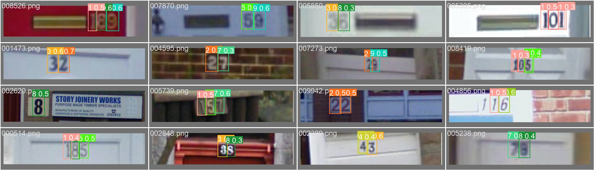

分别用ResNet50（1）和YOLOv8（2）实现了字符编码识别任务，题目源自阿里天池竞赛https://tianchi.aliyun.com/competition/entrance/531795
即使运用了较多数据增强技术和参数调优技巧，前者的准确率仍然较低，仅为60%左右
而yolov8的准确率可以接近90%。一定程度上说明了yolo的强大性能。😊

（1）的运行需要安装pytorh即可。具体见https://pytorch.org/  

（2）的运行需要安装ultralytics，具体可以在对应环境内终端输入`pip install ultralytics`

具体可以参考https://docs.ultralytics.com/zh/quickstart/#install-ultralytics
获得更多说明

YOLO在验证集第二个小批量上（8张照片）的预测结果如下：

